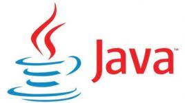
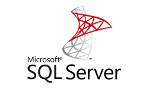

### Nícolas Luchini de Arruda

## Resume

I'm currently studying at Fatec Jundiai and working at company Fatec Jr as java back-end programmer
developer. I like to learnnew subjects as new tools: spring, react, logic and other languages, lambda,
structure data, relational and non-relational database, big data design paterns as well. These can be
showed in my projects, for example, "fatec-empresa-jr-backend", "dscatalog", "project-sds4", 
"project-sds5", "workshop-spring-boot-mondgodb". 

Also, there are others subject that I learnt: 
unit automated tests which can be showed in "AutomatedTests" and, as result of this, 
I'm deeping to learn unit automated tests in controller, services and repositories. Also, integration tests,
integration tests & web.

But, there is one project in my college which does a big impact in society: Marias. In this project,
I work at java developer in the Android Studio and documentation as well. I learn code better in java 
and do diagram class as well. However, the important is I learn that with our codes, we can do the 
best all of society, because "Marias" is a app to help the law about the women's insurance against 
domestic violence. The project's repository is "AppGm".

## Skills

 

### Technologies

    

  

  

 
 

## Projects

__Project dscatalog:__

Link: <a href="https://github.com/nicolasarruda/dscatalog-nicolas">https://github.com/nicolasarruda/dscatalog-nicolas</a>

__Project sds4:__

Link: <a href="https://github.com/nicolasarruda/project-sds4">https://github.com/nicolasarruda/project-sds4</a>

App in netlify: <a href="https://dsvendas-nicolas.netlify.app/">https://dsvendas-nicolas.netlify.app/</a>

__Project fatec-empresa-jr-backend:__

Link:  <a href="https://github.com/nicolasarruda/fatec-empresa-jr-backend">https://github.com/nicolasarruda/fatec-empresa-jr-backend</a>

__Project workshop-spring-boot-mondgodb:__

Link: <a href="https://github.com/nicolasarruda/workshop-spring-boot-mongodb">https://github.com/nicolasarruda/workshop-spring-boot-mongodb</a>

__Project AutomatedTests:__

Link: <a href="https://github.com/nicolasarruda/AutomatedTests">https://github.com/nicolasarruda/AutomatedTests</a>

__Project AppGm:__

Link: <a href="https://github.com/nicolasarruda/AppGm">https://github.com/nicolasarruda/AppGm</a>

## 📫 How to reach me 

<figure align="right">
 
</figure>

- Github: <a href="https://github.com/nicolasarruda">https://github.com/nicolasarruda</a> 
- Linkedin: <a href="https://www.linkedin.com/in/nicolasluchinidearruda/">https://www.linkedin.com/in/nicolasluchinidearruda/</a>
- Instagram: <a href="https://www.instagram.com/nicolas_luchini/?hl=pt-br">https://www.instagram.com/nicolas_luchini/?hl=pt-br</a>        
- Site: <a href="https://nicolasarruda.github.io/nicolasarruda/">https://nicolasarruda.github.io/nicolasarruda/</a>

- E-mail : nlarruda@hotmail.com
- Telephone: +55 (11) 95974-5673
